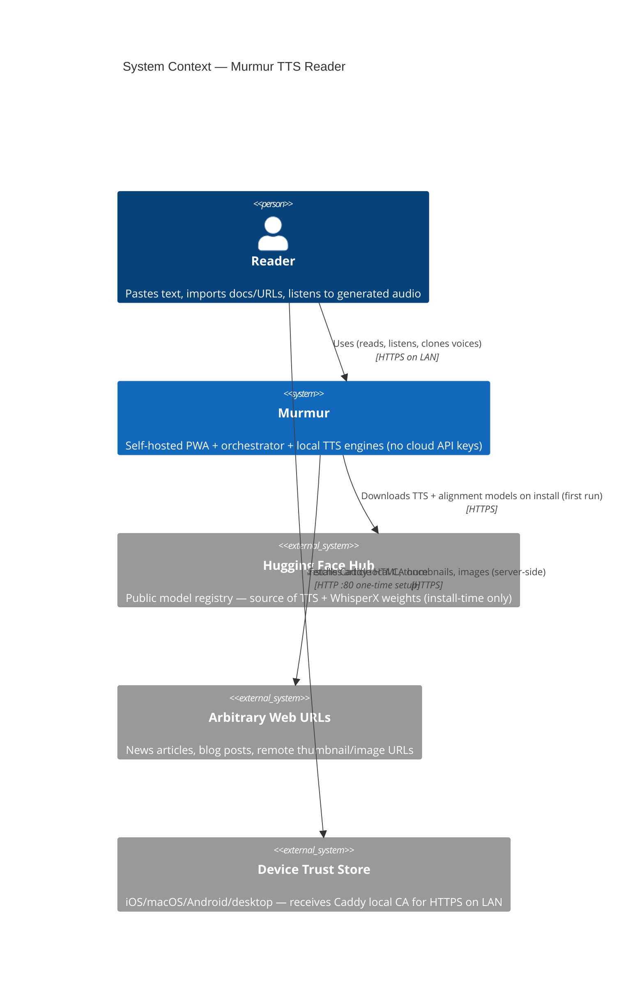
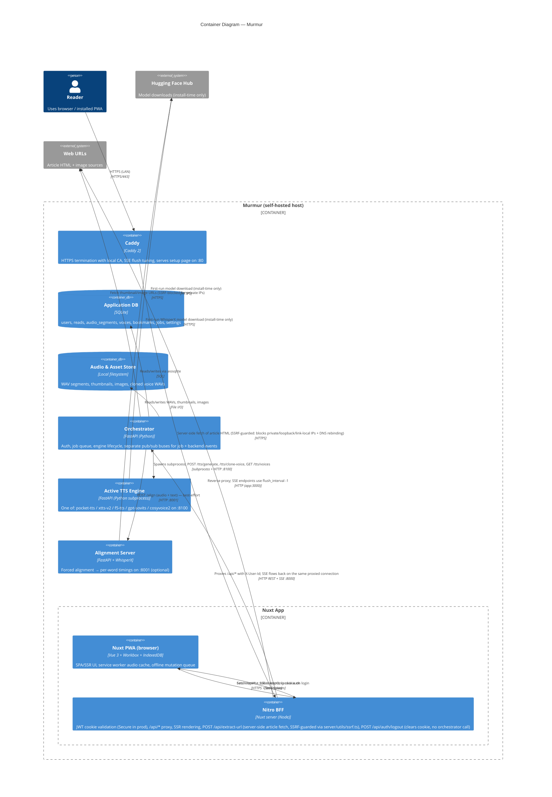
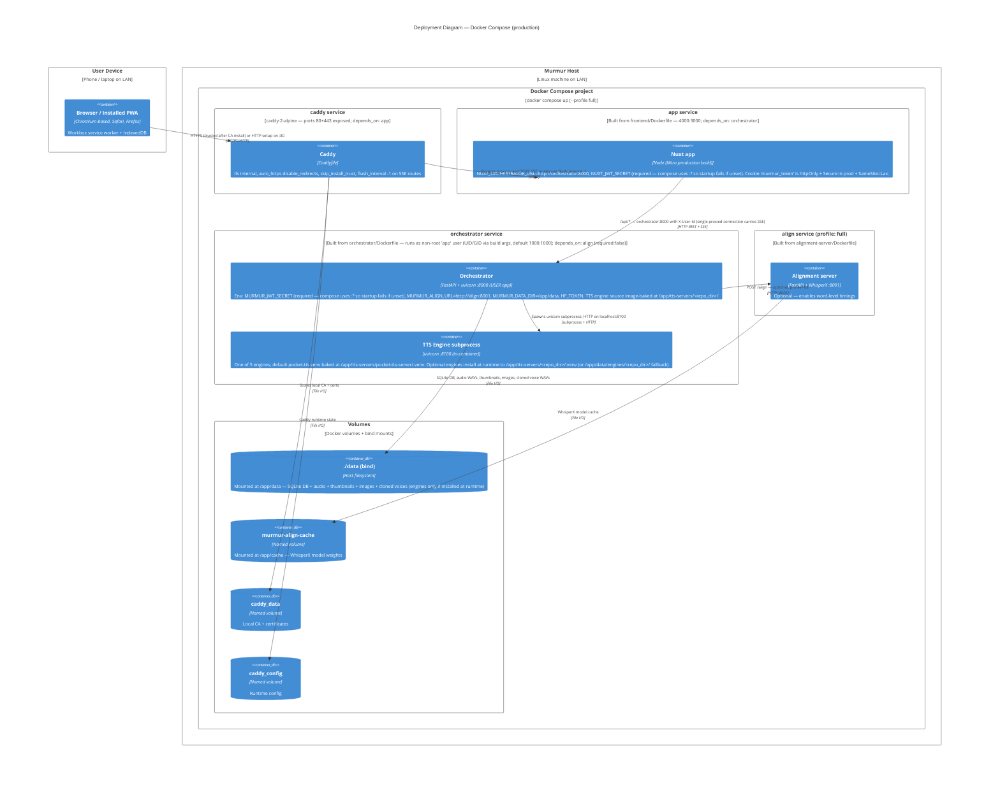

# Murmur — C4 Architecture

This document describes Murmur's architecture at the four standard C4 levels: System Context, Container, Component, and Deployment. Every arrow below corresponds to a real call, subprocess, or file-system relationship in the code. Protocols are labelled on each arrow.

Key facts the diagrams reflect:

- The Nuxt Nitro server is a BFF that validates a JWT from an httpOnly cookie and proxies all `/api/*` traffic to the FastAPI orchestrator with an injected `X-User-Id` header.
- The orchestrator runs **one** TTS engine at a time as a managed subprocess on a single port (default `8100`, configurable via `MURMUR_ENGINE_PORT`). Five engines are interchangeable (pocket-tts, xtts-v2, f5-tts, gpt-sovits, cosyvoice2).
- The orchestrator best-effort calls the alignment server (WhisperX) at `http://align:8001` after each segment's WAV is generated.
- TTS generation is job-based and FIFO; progress is streamed to clients via SSE.
- All persistent user data lives in a single `./data` volume mounted into the orchestrator container (SQLite DB + audio WAVs + thumbnails + images + cloned voice WAVs). TTS engine source + venvs are **baked into the orchestrator image** at `/app/tts-servers/<repo_dir>/`; the `./data/engines/` path is only used as a fallback for engines installed at runtime.

---

## Level 1 — System Context

The context diagram shows Murmur as a single self-hosted system, the people who use it, and the external dependencies it reaches out to. The Hugging Face Hub is only contacted at install-time (first-run / model pulls) — `tts-servers/gptsovits-server/post_install.py` imports `huggingface_hub` directly, and the alignment server pulls weights transitively via WhisperX. Arbitrary web URLs are fetched server-side by the Nitro BFF (`frontend/server/api/extract-url.post.ts` — article HTML, SSRF-guarded via `frontend/server/utils/ssrf.ts`: blocks non-http(s), `localhost`, and literal/DNS-resolved private, loopback, link-local, and CGNAT addresses) and by the orchestrator (thumbnail / image fetches, SSRF-blocked for private IPs in `orchestrator/main.py`).

---

## Level 2 — Container Diagram

This diagram zooms inside Murmur. The browser runs a Nuxt PWA; the server-side Nitro runtime is the auth/proxy BFF and is the only component that reaches external web URLs on behalf of the reader (for article HTML). The orchestrator is the only process that touches the SQLite database and the audio filesystem. It spawns one TTS engine subprocess at a time (port 8100) from a registry of five, and best-effort calls the optional alignment server. Caddy terminates HTTPS on the LAN and is the only container exposed to the network.

SSE streams flow end-to-end over a single proxied HTTP connection — Nitro uses `proxyRequest` in `server/api/[...].ts`, so there is no separate push channel from the orchestrator back to Nitro.

---

## Level 3 — Component Diagram (Orchestrator)

The orchestrator is by far the most complex container, so it merits a component breakdown. These components correspond to real Python modules: `routers/*.py`, `engine_manager.py`, `job_worker.py`, `job_events.py`, `auth.py`, `db.py`, `sentence_splitter.py`, and `engine_registry.py`.

Two independent pub/sub buses exist and are not connected:

- `JobEventBus` (`orchestrator/job_events.py`) — per-user, keyed by `user_id`, drives `/queue/events`.
- `EngineManager` internal listener list (`orchestrator/engine_manager.py:39`) — a flat `list[asyncio.Queue]`, **global** (not per-user), drives `/backends/events` via `engine_manager.subscribe()`.

The orchestrator also registers several media routes directly on the FastAPI `app` (not in any router): `GET /audio/{read_id}/bundle`, `GET /audio/{read_id}/{segment_index}`, `POST /reads/{read_id}/thumbnail`, `GET /thumbnails/{read_id}`, `POST /reads/{read_id}/images`, `GET /images/{read_id}/{index}`. Two lifespan hooks run on startup: `sync_builtin_voices()` auto-inserts the active engine's builtin voices after pocket-tts auto-starts, and `reset_stale_jobs()` re-queues any jobs left in `running` or `waiting_for_backend` after a restart.

```mermaid
C4Component
  title Component Diagram — Orchestrator (FastAPI)

  Container(nitro, "Nitro BFF", "Node", "Calls orchestrator with X-User-Id header")
  System_Ext(engine, "Active TTS Engine", "FastAPI subprocess on :8100")
  System_Ext(align, "Alignment Server", "FastAPI on :8001")
  ContainerDb(sqlite, "SQLite DB", "aiosqlite")
  ContainerDb(datafs, "Filesystem", "data/audio, data/thumbnails, data/images, data/voices (engines only if installed at runtime)")

  Container_Boundary(orch, "Orchestrator") {
    Component(authRouter, "auth_router", "FastAPI router", "POST /auth/{login,register} (rate-limited: 5/min login, 3/min register per IP), GET /auth/me — bcrypt + JWT issuance")
    Component(readsRouter, "reads router", "FastAPI router", "CRUD /reads, /reads/:id/generate (enqueues job)")
    Component(mediaRoutes, "Direct app routes (media)", "Endpoints on app, not in any router", "GET /audio/:id/bundle?segments=..., GET /audio/:id/:seg, POST /reads/:id/thumbnail, GET /thumbnails/:id, POST /reads/:id/images, GET /images/:id/:idx")
    Component(voicesRouter, "voices router", "FastAPI router", "/voices list, /voices/sync, /voices/clone (forwards WAV to engine)")
    Component(backendsRouter, "backends router", "FastAPI router", "/backends list, /select, /install, /events (SSE)")
    Component(queueRouter, "queue router", "FastAPI router", "/queue list, cancel, /queue/events (SSE job progress)")
    Component(bookmarksRouter, "bookmarks router", "FastAPI router", "CRUD /reads/:id/bookmarks")
    Component(healthRouter, "health router", "FastAPI router", "/health — DB status + active engine; alignment field reserved (currently always null)")
    Component(settingsRouter, "settings router", "FastAPI router", "per-user key/value settings")

    Component(lifespan, "lifespan hooks", "main.py", "sync_builtin_voices() on engine start; reset_stale_jobs() on startup")

    Component(authLib, "auth.py", "Module", "bcrypt hash/verify, PyJWT encode/decode, X-User-Id dependency (401 on missing/invalid)")
    Component(rateLimit, "rate_limit.py", "Module", "In-memory sliding-window limiter (per client IP) — 5 logins/min, 3 registers/min; 429 on overflow")
    Component(splitter, "sentence_splitter", "Module", "Smart sentence segmentation for new reads")
    Component(engineMgr, "EngineManager", "Singleton", "Spawns one uvicorn subprocess on :8100, install/uninstall venvs, health loop")
    Component(engineBus, "EngineManager listeners", "list[asyncio.Queue] (global)", "Subscribe via engine_manager.subscribe(); emits backend:status events — not per-user")
    Component(registry, "engine_registry", "Module", "Static metadata for 5 engines (name, repo_dir, size, gpu, builtin_voices)")
    Component(jobWorker, "JobWorker", "asyncio Task", "FIFO loop: picks pending job, per-segment TTS + align, updates progress")
    Component(jobBus, "JobEventBus", "asyncio Queues (per-user)", "Per-user pub/sub keyed by user_id for job:started/progress/completed/failed/cancelled events")
    Component(dbMod, "db.py", "Module", "open_db/get_db context managers (foreign_keys=ON only); init_db sets WAL once; lightweight migrations")
  }

  Rel(nitro, authRouter, "Login/register/me", "HTTP REST")
  Rel(nitro, readsRouter, "Reads CRUD, generate", "HTTP REST")
  Rel(nitro, mediaRoutes, "Audio bundle + stream, thumbnail + image upload/fetch", "HTTP REST")
  Rel(nitro, voicesRouter, "List/clone voices", "HTTP REST")
  Rel(nitro, backendsRouter, "List/select/install engines + SSE", "HTTP REST + SSE")
  Rel(nitro, queueRouter, "List/cancel jobs + SSE", "HTTP REST + SSE")
  Rel(nitro, bookmarksRouter, "CRUD bookmarks", "HTTP REST")
  Rel(nitro, healthRouter, "Health check", "HTTP REST")
  Rel(nitro, settingsRouter, "User settings", "HTTP REST")

  Rel(authRouter, authLib, "Hash, verify, issue JWT")
  Rel(authRouter, rateLimit, "Depends(rate_limit_login/register) on /auth/login + /auth/register")
  Rel(readsRouter, splitter, "Split new text into segments")
  Rel(readsRouter, jobWorker, "Enqueues job via DB row (INSERT jobs)")
  Rel(voicesRouter, engineMgr, "Get active engine URL")
  Rel(voicesRouter, engine, "POST /tts/clone-voice, GET /tts/voices", "HTTP")
  Rel(backendsRouter, engineMgr, "select/install/uninstall engines")
  Rel(backendsRouter, engineBus, "SSE subscribe (global) for backend:status events")
  Rel(queueRouter, jobBus, "SSE subscribe (per-user) for job:* events")

  Rel(engineMgr, registry, "Lookup engine metadata")
  Rel(engineMgr, engine, "subprocess.create_subprocess_exec uvicorn; health poll /health", "subprocess + HTTP")
  Rel(engineMgr, engineBus, "Emit backend:status events on install/start/stop/health transitions")

  Rel(lifespan, engineMgr, "Auto-start pocket-tts on boot")
  Rel(lifespan, engine, "sync_builtin_voices calls GET /tts/voices", "HTTP")
  Rel(lifespan, dbMod, "reset_stale_jobs: UPDATE jobs running/waiting → pending", "SQL")

  Rel(jobWorker, dbMod, "Pick pending job, update progress/status", "SQL")
  Rel(jobWorker, engineMgr, "Get active engine URL, copy cloned voice WAV")
  Rel(jobWorker, engine, "POST /tts/generate per segment", "HTTP")
  Rel(jobWorker, align, "POST /align (audio + text) — best-effort", "HTTP")
  Rel(jobWorker, datafs, "Write WAV to data/audio/<readId>/<segIdx>.wav", "File I/O")
  Rel(jobWorker, jobBus, "Emit job:started/progress/completed/failed/cancelled (per-user)")

  Rel(mediaRoutes, datafs, "Read/write audio, thumbnail, image files", "File I/O")
  Rel(authRouter, dbMod, "SQL via get_db dependency")
  Rel(readsRouter, dbMod, "SQL via get_db dependency")
  Rel(voicesRouter, dbMod, "SQL via get_db dependency")
  Rel(bookmarksRouter, dbMod, "SQL via get_db dependency")
  Rel(settingsRouter, dbMod, "SQL via get_db dependency")
  Rel(queueRouter, dbMod, "SQL via get_db dependency")
  Rel(dbMod, sqlite, "aiosqlite connection (foreign_keys=ON)", "SQL")
```

---

## Level 4 — Deployment (Docker Compose)

The production topology is defined by `docker-compose.yml`. Caddy is the sole network-exposed container (80 + 443). The `app` container runs the Nuxt production build. The `orchestrator` container owns the single mounted `./data` bind volume — it holds the SQLite database, audio WAVs, thumbnails, images, and cloned voice WAVs. TTS engine source and default venvs are **baked into the orchestrator image** at `/app/tts-servers/<repo_dir>/` (see `orchestrator/Dockerfile`); engines installed at runtime fall back to `/app/data/engines/<repo_dir>/`. The `align` service is opt-in behind the `full` Docker Compose profile and uses a dedicated `murmur-align-cache` volume for WhisperX weights. `caddy_data` / `caddy_config` are named volumes holding the local CA and Caddy state.

`depends_on` chain: `caddy → app → orchestrator → align` (align is `required: false`, so the stack starts without it when the `full` profile is off). Caddy is configured with `auto_https disable_redirects` and `skip_install_trust` in the global block, and the two SSE routes (`/api/backends/events`, `/api/queue/events`) set `flush_interval -1` so events ship immediately; all other routes use default buffered flushing.

---

## Key Design Decisions

- **BFF proxy pattern.** The frontend never reaches the orchestrator directly. Nitro's `server/middleware/auth.ts` verifies the JWT cookie and `server/api/[...].ts` re-writes `/api/*` to the orchestrator with an `X-User-Id` header via `proxyRequest`. SSE responses flow back over this same proxied connection — there is no separate push channel. Two routes live only on Nitro: `POST /api/extract-url` (server-side article fetch) and `POST /api/auth/logout` (clears the cookie; no orchestrator call).
- **JWT in httpOnly cookie.** The orchestrator issues an HS256 JWT (72h) on login/register. Nitro stores it as `murmur_token` (httpOnly, `Secure` in production, `SameSite=Lax`) so the browser JS can never read it. On every request, Nitro decodes it with `jose` and injects the verified `user_id`. Both secrets are fail-closed: `orchestrator/config.py::_resolve_jwt_secret` raises at import time if `MURMUR_JWT_SECRET` is missing (dev-only escape hatch: `MURMUR_ALLOW_DEV_SECRET=1`), and `docker-compose.yml` uses `${MURMUR_JWT_SECRET:?...}` on both the `app` and `orchestrator` services so the stack refuses to start without it. The orchestrator's `X-User-Id` dependency returns **401** (not 422) for missing or non-integer headers.
- **One engine at a time on a fixed port.** `EngineManager` is a singleton that holds at most one `asyncio.subprocess.Process`. All five TTS engines run on the same port (default `8100`, via `MURMUR_ENGINE_PORT`). Switching engines stops the current subprocess before starting the next. This keeps memory bounded and avoids port-allocation complexity.
- **Installable engines with image-baked default.** The default engine (`pocket-tts`) has its source + venv baked into the orchestrator image. The other four engines have lightweight source copied into the image; their venvs install at runtime (CUDA wheel if `nvidia-smi` present, CPU wheel otherwise) plus optional `post_install.py`. The orchestrator exposes `/backends/install`, `/select`, `/uninstall`. Runtime-installed engine venvs prefer the image-baked `tts-servers/<repo_dir>/` directory, falling back to `./data/engines/<repo_dir>/`.
- **FIFO job queue.** `JobWorker` is a single asyncio task that picks the oldest pending row from `jobs`, iterates `audio_segments` that haven't been generated, and for each one: (1) POSTs to the engine, (2) writes the WAV to disk, (3) best-effort POSTs to the alignment server, (4) updates `progress`. A crash leaves partially-generated reads recoverable on restart (`reset_stale_jobs` + `audio_generated` flag per segment).
- **Two independent SSE buses.** `JobEventBus` is **per-user** (keyed by `user_id`) and drives `/queue/events`. The `EngineManager` keeps its own flat `list[asyncio.Queue]` that is **global** (not user-scoped) and drives `/backends/events`. The two buses do not share state or listeners. Caddy sets `flush_interval -1` on exactly these two paths so events ship immediately.
- **Startup hooks.** `sync_builtin_voices()` runs after the default engine auto-starts, fetching `/tts/voices` from the engine and upserting builtin voices into the DB. `reset_stale_jobs()` re-queues any jobs left in `running` or `waiting_for_backend` from a previous run so the worker can resume them.
- **Per-user isolation.** Every table keyed by `user_id`; every router dependency extracts `X-User-Id` via `get_current_user_id`.
- **SQLite + bind-mounted filesystem.** Durable user state lives in `./data`: `murmur.db`, `audio/<readId>/<segIdx>.wav`, `thumbnails/`, `images/<readId>/`, `voices/cloned/<userId>/`. `init_db()` enables WAL journal mode once at startup; per-request `get_db()` / `open_db()` only set `PRAGMA foreign_keys=ON`. Backup is `tar czf data.tgz data/`.
- **Alignment is optional and best-effort.** Failures in the alignment call are swallowed at debug level — a read still plays, it just lacks word-level highlighting. The `/health` response includes an `alignment` field that is reserved (currently hard-coded `None` in `routers/health.py`).
- **SSRF hardening.** Image URL fetching in `orchestrator/main.py` rejects `localhost`, private, loopback, and link-local addresses before issuing the HTTP GET. The Nitro-side `POST /api/extract-url` now delegates to `frontend/server/utils/ssrf.ts` (`isPrivateOrDisallowedHost` for URL-shape + literal IPs, `resolveIsPrivate` for DNS rebinding defence), blocking non-http(s) schemes, `localhost`, and IPv4/IPv6 private, loopback, link-local, and CGNAT ranges. See `docs/superpowers/plans/2026-04-22-security-hardening.md` for the full hardening pass.
- **Auth-endpoint rate limiting.** `orchestrator/rate_limit.py` is an in-memory sliding-window limiter keyed by client IP. `auth_router` applies it via `Depends(rate_limit_login)` (5/min) and `Depends(rate_limit_register)` (3/min); overflow returns HTTP 429. State lives in the single orchestrator process — if we ever scale horizontally this must move to Redis.
- **CI.** `.github/workflows/ci.yml` runs two jobs on every push to `main` and every PR: a `frontend` job (Node 22 + `nuxi typecheck` + `npm run test`), and an `orchestrator` job (uv + `ruff check` + pytest, with `MURMUR_ALLOW_DEV_SECRET=1` so the fail-closed JWT secret does not block tests).
- **Audio bundle download.** `GET /audio/{read_id}/bundle` accepts an optional `?segments=1,2,3` query param (comma-separated indices) and returns a ZIP_STORED archive; without the param, all generated segments are bundled.
- **Offline-first PWA.** Workbox runtime rules cache audio segments (`CacheFirst`, 30-day TTL, 5000 entries), read lists/details (`NetworkFirst`), voices (`StaleWhileRevalidate`). An IndexedDB mutation queue replays failed writes on reconnect.
- **Caddy local CA for LAN HTTPS.** PWA install requires a secure origin. `tls internal` issues a locally-trusted cert; the global block sets `auto_https disable_redirects` and `skip_install_trust`. Users install the CA once from the HTTP `:80` setup page, then the installed PWA works on `https://<LAN_IP>`.
