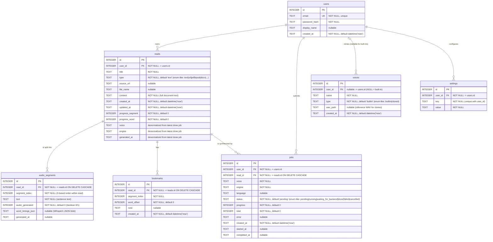

# Murmur Data Model — Entity Relationship Diagram

## Executive Summary

Murmur persists all orchestrator state in a single SQLite database (WAL-mode, foreign keys enforced at runtime) defined by `orchestrator/schema.sql`. The domain is organized around seven tables: `users` own `reads` (the text documents), each read is decomposed into ordered `audio_segments` (one per sentence) and can accumulate user `bookmarks`; TTS synthesis is modeled as async `jobs` that belong to a user and a read; `voices` are either global built-ins (`user_id IS NULL`) or per-user clones; and `settings` store arbitrary per-user key/value preferences. The schema is largely third-normal form, but it purposefully denormalizes the *most recent completed* voice/engine/generated_at onto `reads` (for cheap library rendering), stores WhisperX word timings as an opaque JSON blob on each segment (`word_timings_json`), and — characteristically for SQLite — uses nominal `TEXT`/`INTEGER` typing with string enums for `reads.type`, `voices.type`, and `jobs.status`.

## Mermaid ER Diagram

> SQLite uses dynamic (nominal) column types. `INTEGER` and `TEXT` above are the declared affinities from `schema.sql`; SQLite does not enforce them strictly, nor does it enforce `CHECK` constraints that are not declared. `PRAGMA foreign_keys=ON` is set at connection time in `orchestrator/db.py`, so the `REFERENCES` clauses are enforced at runtime.

---

## Per-Table Breakdown

### `users`

| Column | Type | Null | Default | Unique | Purpose |
|--------|------|------|---------|--------|---------|
| `id` | INTEGER | NO | — | PK | Surrogate primary key |
| `email` | TEXT | NO | — | YES | Login identifier |
| `password_hash` | TEXT | NO | — | — | bcrypt hash (never returned in responses) |
| `display_name` | TEXT | YES | — | — | Optional friendly name |
| `created_at` | TEXT | NO | `datetime('now')` | — | UTC timestamp string |

- **Primary key:** `id` (`AUTOINCREMENT`)
- **Foreign keys:** none
- **Existing indexes:** implicit unique index on `email` from `UNIQUE` constraint.
- **No missing indexes** — every query hits `id` (PK) or `email` (unique).

### `reads`

| Column | Type | Null | Default | Unique | Purpose |
|--------|------|------|---------|--------|---------|
| `id` | INTEGER | NO | — | PK | Surrogate key |
| `user_id` | INTEGER | NO | — | — | FK -> `users.id`; owner |
| `title` | TEXT | NO | — | — | Display title |
| `type` | TEXT | NO | `'text'` | — | Source kind (text/url/pdf/epub/docx/txt/html/markdown) — **enum-like, no CHECK** |
| `source_url` | TEXT | YES | — | — | Original URL if scraped |
| `file_name` | TEXT | YES | — | — | Original filename if imported |
| `content` | TEXT | NO | — | — | Full document text (sentence-split into `audio_segments` at create time) |
| `created_at` | TEXT | NO | `datetime('now')` | — | Creation timestamp |
| `updated_at` | TEXT | NO | `datetime('now')` | — | Maintained only in the PATCH handler (`routers/reads.py:86`); any future UPDATE path will need to remember to bump it. No trigger enforces this. |
| `progress_segment` | INTEGER | NO | `0` | — | Playback position (denormalized for fast library rendering) |
| `progress_word` | INTEGER | NO | `0` | — | Within-segment word offset |
| `voice` | TEXT | YES | — | — | Denormalized: voice used by latest `done` job |
| `engine` | TEXT | YES | — | — | Denormalized: engine used by latest `done` job |
| `generated_at` | TEXT | YES | — | — | Denormalized: completion time of latest `done` job |

- **Primary key:** `id` (`AUTOINCREMENT`)
- **Foreign keys:** `user_id -> users.id` (no `ON DELETE` clause — defaults to NO ACTION; deleting a user is blocked if they own reads).
- **Existing indexes:** only the implicit PK index.
- **Missing indexes that SHOULD exist:**
  - `CREATE INDEX idx_reads_user_created ON reads(user_id, created_at DESC);` — the library listing query `SELECT r.*, (SELECT COUNT(*) FROM audio_segments WHERE read_id = r.id) FROM reads r WHERE r.user_id = ? ORDER BY r.created_at DESC` (`orchestrator/routers/reads.py:34-35`) is the hottest read path and currently full-scans `reads`.

### `audio_segments`

| Column | Type | Null | Default | Unique | Purpose |
|--------|------|------|---------|--------|---------|
| `id` | INTEGER | NO | — | PK | Surrogate key |
| `read_id` | INTEGER | NO | — | — | FK -> `reads.id` **ON DELETE CASCADE** |
| `segment_index` | INTEGER | NO | — | — | 0-based sentence order within the read |
| `text` | TEXT | NO | — | — | Sentence text |
| `audio_generated` | INTEGER | NO | `0` | — | Boolean (0/1) — true after WAV written |
| `word_timings_json` | TEXT | YES | — | — | Opaque JSON blob from WhisperX (denormalization) |
| `generated_at` | TEXT | YES | — | — | When this segment's WAV was produced |

- **Primary key:** `id` (`AUTOINCREMENT`)
- **Foreign keys:** `read_id -> reads.id ON DELETE CASCADE`.
- **Existing indexes:** only the implicit PK index.
- **Missing indexes that SHOULD exist:**
  - `CREATE INDEX idx_audio_segments_read ON audio_segments(read_id, segment_index);` — covers ordered fetch `SELECT * FROM audio_segments WHERE read_id = ? ORDER BY segment_index` (`orchestrator/routers/reads.py:208`), the counting subqueries in the library list (`routers/reads.py:34`) and pending-work count (`routers/reads.py:166`), and the worker's pending-segment scan `SELECT * FROM audio_segments WHERE read_id = ? AND audio_generated = 0` (`orchestrator/job_worker.py:113-114`).
  - `UNIQUE(read_id, segment_index)` would also be a correctness win — there's currently nothing preventing duplicate segment indices for the same read.

### `voices`

| Column | Type | Null | Default | Unique | Purpose |
|--------|------|------|---------|--------|---------|
| `id` | INTEGER | NO | — | PK | Surrogate key |
| `user_id` | INTEGER | YES | — | — | FK -> `users.id`; `NULL` sentinel for built-ins |
| `name` | TEXT | NO | — | — | Voice identifier sent to TTS engines |
| `type` | TEXT | NO | `'builtin'` | — | **enum-like: `builtin` or `cloned`, no CHECK** |
| `wav_path` | TEXT | YES | — | — | Filesystem path to reference WAV for clones |
| `created_at` | TEXT | NO | `datetime('now')` | — | Creation timestamp |

- **Primary key:** `id` (`AUTOINCREMENT`)
- **Foreign keys:** `user_id -> users.id` (nullable; no `ON DELETE` clause).
- **Existing indexes:** implicit unique index from `UNIQUE(user_id, name)` — covers per-user dedupe. Because `user_id` is the leading column, this index *is* usable for `WHERE user_id = ?` lookups.
- **Missing indexes that SHOULD exist:**
  - `CREATE INDEX idx_voices_name ON voices(name);` — the worker's voice lookup `SELECT wav_path FROM voices WHERE name = ? AND (user_id IS NULL OR user_id = ?)` (`orchestrator/job_worker.py:296-298`) filters on `name` first; the existing `UNIQUE(user_id, name)` is keyed `(user_id, name)` so SQLite cannot use it for a `name`-first predicate.
  - Consider `CREATE INDEX idx_voices_user_type_name ON voices(user_id, type, name);` to cover the list ordering `... WHERE user_id IS NULL OR user_id = ? ORDER BY type, name` in `orchestrator/routers/voices.py:21,77` — though with typical voice counts (tens) this is a low-priority win.

### `bookmarks`

| Column | Type | Null | Default | Unique | Purpose |
|--------|------|------|---------|--------|---------|
| `id` | INTEGER | NO | — | PK | Surrogate key |
| `read_id` | INTEGER | NO | — | — | FK -> `reads.id` **ON DELETE CASCADE** |
| `segment_index` | INTEGER | NO | — | — | Target segment in the read |
| `word_offset` | INTEGER | NO | `0` | — | Sub-segment position |
| `note` | TEXT | YES | — | — | Optional user note |
| `created_at` | TEXT | NO | `datetime('now')` | — | Creation timestamp |

- **Primary key:** `id` (`AUTOINCREMENT`)
- **Foreign keys:** `read_id -> reads.id ON DELETE CASCADE`.
- **Existing indexes:** only the implicit PK index.
- **Missing indexes that SHOULD exist:**
  - `CREATE INDEX idx_bookmarks_read ON bookmarks(read_id, segment_index, word_offset);` — the listing query joins on `read_id` and orders by `segment_index, word_offset` (`orchestrator/routers/bookmarks.py:16-22`); the composite form covers both the predicate and the `ORDER BY` so SQLite can stream rows without a sort.

### `jobs`

| Column | Type | Null | Default | Unique | Purpose |
|--------|------|------|---------|--------|---------|
| `id` | INTEGER | NO | — | PK | Surrogate key |
| `user_id` | INTEGER | NO | — | — | FK -> `users.id`; job owner |
| `read_id` | INTEGER | NO | — | — | FK -> `reads.id` **ON DELETE CASCADE** |
| `voice` | TEXT | NO | — | — | Voice name frozen at submit time |
| `engine` | TEXT | NO | — | — | Engine name frozen at submit time |
| `language` | TEXT | YES | — | — | Optional ISO language hint |
| `status` | TEXT | NO | `'pending'` | — | **enum-like: `pending` / `running` / `waiting_for_backend` / `done` / `failed` / `cancelled`, no CHECK** |
| `progress` | INTEGER | NO | `0` | — | Segments completed so far |
| `total` | INTEGER | NO | `0` | — | Segments in scope |
| `error` | TEXT | YES | — | — | Error message on failure |
| `created_at` | TEXT | NO | `datetime('now')` | — | Enqueue time (FIFO key) |
| `started_at` | TEXT | YES | — | — | When worker picked it up |
| `completed_at` | TEXT | YES | — | — | When it terminated |

- **Primary key:** `id` (`AUTOINCREMENT`)
- **Foreign keys:** `user_id -> users.id`; `read_id -> reads.id ON DELETE CASCADE`.
- **Existing indexes:** only the implicit PK index.
- **Missing indexes that SHOULD exist:**
  - `CREATE INDEX idx_jobs_user_created ON jobs(user_id, created_at DESC);` — covers the queue listing `SELECT * FROM jobs WHERE user_id = ? ORDER BY created_at DESC` (`orchestrator/routers/queue.py:23`) and the per-user active-count check `SELECT COUNT(*) FROM jobs WHERE user_id = ? AND status IN ('pending','running')` (`orchestrator/routers/reads.py:184`).
  - `CREATE INDEX idx_jobs_status_created ON jobs(status, created_at);` — covers the worker's FIFO scan `SELECT * FROM jobs WHERE status = 'pending' ORDER BY created_at ASC LIMIT 1` (`orchestrator/job_worker.py:60-62`), the resume-waiting scan `UPDATE jobs SET status = 'pending' WHERE status = 'waiting_for_backend'` (`orchestrator/job_worker.py:53-55`), the startup reset `UPDATE jobs SET status = 'pending', started_at = NULL WHERE status IN ('running', 'waiting_for_backend')` (`orchestrator/main.py:54-56`), and the migration's `WHERE status = 'done'` aggregate (`orchestrator/db.py:34-36`).
  - `CREATE INDEX idx_jobs_read_status ON jobs(read_id, status);` — covers `SELECT id FROM jobs WHERE read_id = ? AND status IN ('pending','running','waiting_for_backend')` (`orchestrator/routers/reads.py:145`).

### `settings`

| Column | Type | Null | Default | Unique | Purpose |
|--------|------|------|---------|--------|---------|
| `id` | INTEGER | NO | — | PK | Surrogate key |
| `user_id` | INTEGER | NO | — | — | FK -> `users.id` |
| `key` | TEXT | NO | — | — | Setting name |
| `value` | TEXT | NO | — | — | Setting value (stringified) |

- **Primary key:** `id` (`AUTOINCREMENT`)
- **Foreign keys:** `user_id -> users.id` (no `ON DELETE` clause).
- **Existing indexes:** implicit unique index from `UNIQUE(user_id, key)`, which covers the only query pattern `SELECT key, value FROM settings WHERE user_id = ?` (`orchestrator/routers/settings.py:16,28`) and the `ON CONFLICT(user_id, key) DO UPDATE` upsert (`routers/settings.py:24`).
- **No missing indexes.**

---

## Relationships

| Parent → Child | Cardinality | FK Column | `ON DELETE` | Enforced? |
|----------------|-------------|-----------|-------------|-----------|
| `users` → `reads` | 1 : N | `reads.user_id` | (unspecified → `NO ACTION`) | Yes (runtime) |
| `users` → `jobs` | 1 : N | `jobs.user_id` | (unspecified → `NO ACTION`) | Yes |
| `users` → `voices` | 0..1 : N | `voices.user_id` (nullable; `NULL` = built-in) | (unspecified → `NO ACTION`) | Yes |
| `users` → `settings` | 1 : N | `settings.user_id` | (unspecified → `NO ACTION`) | Yes |
| `reads` → `audio_segments` | 1 : N | `audio_segments.read_id` | `CASCADE` | Yes |
| `reads` → `bookmarks` | 1 : N | `bookmarks.read_id` | `CASCADE` | Yes |
| `reads` → `jobs` | 1 : N | `jobs.read_id` | `CASCADE` | Yes |

All foreign keys are enforced because `orchestrator/db.py` executes `PRAGMA foreign_keys=ON` on every connection (init, request-scoped, and `open_db` contexts). SQLite's default without this pragma is to *parse but ignore* FK clauses.

---

## Schema Observations & Recommendations

### Normalization

- The schema is already close to 3NF. The one intentional deviation is on `reads.voice` / `reads.engine` / `reads.generated_at`, which are cached from the most recent `jobs` row with `status = 'done'`. That is a reasonable denormalization — library rendering would otherwise need a correlated subquery per row — but it is **not maintained by a trigger**; `orchestrator/db.py:21-56` shows the values are populated in a one-shot migration backfill and are presumably written on job completion by the worker. Any future code path that marks a job `done` must update these columns, or they will silently drift.
- `audio_segments.word_timings_json` is a JSON blob stored as `TEXT`. This is a deliberate denormalization (the alternative would be a `word_timings(segment_id, word_index, start_ms, end_ms, text)` child table). Given that word timings are always read/written as a whole and never queried by word, the JSON approach is defensible — but it means you cannot, for example, run a search like "find segments whose timings exceed N seconds" without loading and parsing every blob.
- `reads.content` duplicates the concatenation of `audio_segments.text`. This is convenient (preserves exact original text including whitespace that the sentence splitter drops) but it means a read's "truth" lives in two places; edits to segment text would desync.

### Missing Indexes (summary — 8 recommended, with priority tiers)

All are derivable directly from the queries cited above. Priorities: **P0** = hot path on every user-facing request; **P1** = frequent but not per-request; **P2** = marginal / small-catalog.

1. **[P0]** `CREATE INDEX idx_audio_segments_read ON audio_segments(read_id, segment_index);` — ordered segment fetch (`routers/reads.py:208`), pending-count (`routers/reads.py:166`), worker scan (`job_worker.py:113-114`). Also rescues the `ON DELETE CASCADE` traversal during `DELETE FROM reads WHERE id = ?` (`routers/reads.py:110`).
2. **[P0]** `CREATE INDEX idx_jobs_status_created ON jobs(status, created_at);` — FIFO worker dispatch (`job_worker.py:60-62`), resume-waiting (`job_worker.py:53-55`), startup reset (`main.py:54-56`), migration aggregate (`db.py:34-36`).
3. **[P1]** `CREATE INDEX idx_reads_user_created ON reads(user_id, created_at DESC);` — library list (`routers/reads.py:34-35`).
4. **[P1]** `CREATE INDEX idx_jobs_user_created ON jobs(user_id, created_at DESC);` — queue listing (`routers/queue.py:23`), per-user active count (`routers/reads.py:184`).
5. **[P1]** `CREATE INDEX idx_jobs_read_status ON jobs(read_id, status);` — active-job check before regenerating (`routers/reads.py:145`).
6. **[P1]** `CREATE INDEX idx_bookmarks_read ON bookmarks(read_id, segment_index, word_offset);` — bookmark listing; composite covers the predicate and `ORDER BY` (`routers/bookmarks.py:16-22`).
7. **[P1]** `CREATE INDEX idx_voices_name ON voices(name);` — worker voice lookup `WHERE name = ? AND (user_id IS NULL OR user_id = ?)` (`job_worker.py:296-298`); the `UNIQUE(user_id, name)` index is not usable because the predicate is `name`-first.
8. **[P2]** `CREATE INDEX idx_voices_user_type_name ON voices(user_id, type, name);` — voice listing order (`routers/voices.py:21,77`). Low priority; catalog is small.

> Note: there is **no explicit index** today on `jobs.user_id`, `jobs.read_id`, `jobs.status`, `reads.user_id`, `bookmarks.read_id`, or `audio_segments.read_id`. SQLite does *not* auto-index foreign keys. On a SQLite backend this is the single biggest perf lever available.

### Integrity Gaps (flagged)

1. **No `ON DELETE CASCADE` from `users`.** Deleting a user will fail outright (FK violation) as long as any `reads`, `jobs`, `voices`, or `settings` row references them. There is no user-deletion endpoint today, but when one is added, either `CASCADE` is needed on these four FKs or an explicit multi-statement tear-down.
2. **No CHECK constraint on `reads.type`.** Any arbitrary string can be inserted; the frontend vocabulary (`text`/`url`/`pdf`/`epub`/`docx`/`txt`/...) is enforced only by convention.
3. **No CHECK constraint on `voices.type`.** Only `'builtin'` and `'cloned'` are valid, but nothing prevents other values.
4. **No CHECK constraint on `jobs.status`.** The router and worker code use a closed set (`pending` / `running` / `waiting_for_backend` / `done` / `failed` / `cancelled`), but a stray value will silently persist and then never be dispatched.
5. **No CHECK constraint on `audio_segments.audio_generated ∈ (0,1)`.** It's used as a boolean but typed as INTEGER.
6. **No UNIQUE(read_id, segment_index) on `audio_segments`.** Duplicates are possible (e.g. concurrent creates) and would silently corrupt ordered playback.
7. **`reads.updated_at` is maintained only in the PATCH handler** (`routers/reads.py:86`). There is no trigger; any future `UPDATE` path (e.g. job-completion denormalization writes, regenerate reset) will need to remember to bump it, or the column will silently drift.
8. **`voices.user_id` nullability encodes two meanings (built-in vs. user-owned) into one column.** This is a common convention but it means per-user uniqueness (`UNIQUE(user_id, name)`) does *not* prevent two different users from each cloning a voice whose name collides with a built-in — because SQLite treats each `NULL` as distinct, so `UNIQUE(user_id, name)` permits multiple `(NULL, 'alice')` rows. Code partially compensates with existence checks before insert at `routers/voices.py:56-58` (builtin sync) and the clone-voice path relies on the filesystem write + engine round-trip plus the unique index to serialize (`routers/voices.py:97-123`); `sync_builtin_voices` also deletes stale builtins first (`routers/voices.py:46-53`). These are still vulnerable under concurrency. A partial-unique-index (`CREATE UNIQUE INDEX ... ON voices(name) WHERE user_id IS NULL`) would guarantee built-in names are globally unique at the DB layer.
9. **`reset_stale_jobs` does not clear `progress`** (`main.py:51-57`). The startup cleanup resets `status` and `started_at` but leaves `progress` intact, so a restarted job resumes with a stale non-zero counter — the worker's subsequent progress events will double-count for any operator tailing them.
10. **`jobs.total` is a one-shot count at enqueue time.** It's computed as the number of segments with `audio_generated = 0` at insert (`routers/reads.py:175-177`). If segments are ever added after enqueue (today they aren't), `total` will desync from reality. The invariant is maintained in application code only — no trigger or CHECK keeps `progress <= total` or refreshes `total`.
11. **`audio_segments` has no FK index**, which is already implicit in recommendation #1 — but worth calling out that the cost falls on `DELETE FROM reads WHERE id = ?` (`routers/reads.py:110`). The `ON DELETE CASCADE` traversal without an index on `audio_segments(read_id)` becomes O(N) over all segments in the DB, not O(N) over the deleted read's segments.
12. **Pydantic layer does not validate enums.** `orchestrator/models.py` types `reads.type`, `voices.type`, `jobs.status`, and engine/backend `status` as plain `str` (lines 29, 51, 67, 104, 118, 130, 151). Any SQL CHECK added (gaps 2–4 above) should be mirrored as `Literal[...]` at the Pydantic layer so validation errors surface at the API boundary, not after a round-trip to the DB.
13. **No numeric range checks.** No CHECK on `jobs.progress <= jobs.total`, on `jobs.progress >= 0`, on `reads.progress_segment >= 0`, or on `reads.progress_word >= 0`. These are all code invariants today; a malicious or buggy writer could persist negative or inconsistent values.

### Other observations

- Timestamps are stored as ISO-8601 `TEXT` via `datetime('now')`, which returns UTC without a `Z` suffix. This works for lexicographic ordering but makes type-safe date arithmetic rely on SQLite's date functions. Acceptable for this workload.
- `PRAGMA journal_mode=WAL` is set once at init in `init_db` (`orchestrator/db.py:13`). This is a persistent, file-level setting — subsequent connections (`get_db`, `open_db`) do *not* re-issue it and correctly inherit WAL mode from the database file.
- `PRAGMA foreign_keys=ON`, by contrast, is a per-connection pragma and is correctly issued on every new connection (`db.py:14, 62, 74`).
- The lightweight migration logic in `_migrate` (`db.py:21-56`) runs on every `init_db`, but the actual backfill only fires when the target column is missing (`if "voice" not in cols:` / `if "generated_at" not in cols`). It is a one-shot schema-upgrade backfill — *not* a per-startup resynchronization of `reads.voice/engine/generated_at` against `jobs`. Any drift caused by the denormalization gap described above will not self-heal on restart.
